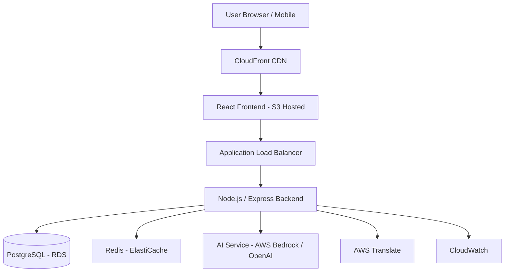

# Design Document: Sahayak – AI Powered Scheme Navigator for Bharat

## Overview

Sahayak is a scalable, cloud-native AI-powered conversational platform designed to bridge the accessibility gap between government welfare schemes and eligible citizens in Bharat.

Despite thousands of active welfare programs, millions of rural and semi-urban citizens remain unaware of benefits due to complex portals, language barriers, and lack of guided access. Sahayak simplifies scheme discovery through deterministic eligibility evaluation combined with AI-driven conversational assistance and multilingual content simplification.

The system is built using a three-tier architecture (React frontend, Node.js backend, PostgreSQL database) deployed on AWS infrastructure. It is optimized for:

- Low-bandwidth environments
- Multilingual accessibility
- High scalability
- Secure session-based data handling

The core innovation lies in combining rule-based eligibility logic (for correctness) with AI-powered natural language interaction (for usability).

## Architecture

### High-Level Architecture

### Component Layers

1. **Presentation Layer**
   - React Single Page Application (SPA)
   - Responsive UI optimized for low bandwidth
   - Multilingual interface
   - Progressive content loading

2. **API Layer**
   - Node.js + Express REST APIs
   - Stateless backend services
   - Input validation & business logic
   - Session management using Redis

3. **Data Layer**
   - PostgreSQL (AWS RDS) for scheme storage
   - Redis (ElastiCache) for:
     - Session storage
     - Scheme caching
     - Translation caching

4. **AI Layer**
   - AI service for:
     - Conversational queries
     - Scheme description simplification
     - Context-aware responses
   - Deterministic rule engine for eligibility

5. **Infrastructure Layer**
   - AWS CloudFront (CDN)
   - AWS S3 (Frontend hosting)
   - ECS Fargate (Containerized backend)
   - RDS Multi-AZ deployment
   - ElastiCache Redis
   - CloudWatch monitoring

### System Workflow

The end-to-end system flow is as follows:

1. User selects preferred language
2. User submits profile details (age, income, occupation, state, category)
3. Backend validates and stores session in Redis
4. EligibilityEvaluator compares profile against all active schemes
5. RecommendationEngine ranks schemes based on eligibility match and benefit value
6. User selects a scheme
7. AIService simplifies scheme details into user-friendly language
8. DocumentChecklistGenerator creates personalized checklist
9. ApplicationGuideGenerator provides step-by-step instructions
10. Conversation context is maintained for follow-up queries

This ensures minimal friction and guided decision-making.

### Core Backend Components

#### EligibilityEvaluator
- Evaluates user profile against scheme criteria
- Applies deterministic logic:
  - Age range
  - Income thresholds
  - Occupation restrictions
  - Geographic eligibility
  - Category conditions
- Returns eligibility score and missing criteria

#### RecommendationEngine
- Ranks schemes using weighted scoring:
  - Eligibility match score (40%)
  - Benefit value (30%)
  - Application ease (20%)
  - Popularity (10%)
- Returns ranked list with reasoning

#### AIService
- Handles:
  - Conversational queries
  - Simplification of complex government text
  - Clarification questions
  - Context-aware responses
- **AI does NOT determine eligibility logic**
- Eligibility remains rule-based for transparency and accuracy

### AI Processing Workflow

Sahayak follows a hybrid AI model:

- **Rule-based eligibility engine** ensures deterministic correctness
- **AI layer** enhances:
  - Natural language understanding
  - Content simplification
  - Contextual responses

This approach:
- Prevents hallucinated eligibility results
- Ensures explainability
- Maintains trustworthiness
- Reduces AI dependency risks

### Security Architecture

- HTTPS (TLS 1.3) enforced for all communication
- AES-256 encryption at rest (RDS)
- Redis session isolation
- No long-term PII storage in MVP
- Role-based admin access
- API rate limiting
- Input sanitization & validation
- Circuit breaker for external AI calls

### Scalability Strategy

Sahayak is designed for horizontal scalability:

- Stateless backend containers (ECS Fargate)
- Auto-scaling policies based on traffic
- RDS read replicas
- Redis caching to reduce DB load
- CDN for static assets
- Graceful degradation if AI services fail

Scales from hundreds to thousands of concurrent users without redesign.

### Low-Bandwidth Optimization

- Lazy loading of non-critical data
- Compressed assets
- Cached viewed schemes
- Progressive rendering
- Minimal API payload sizes

Initial interface loads within 5 seconds on 2G speeds.

### Deployment Architecture

**Frontend:**
- React build deployed to S3
- Served via CloudFront CDN

**Backend:**
- Docker container
- Deployed on ECS Fargate
- Behind Application Load Balancer

**Database:**
- AWS RDS PostgreSQL
- Multi-AZ deployment

**Cache:**
- AWS ElastiCache Redis

**Monitoring:**
- AWS CloudWatch

### Future Scalability Enhancements

- WhatsApp integration
- Voice-based interaction (AWS Transcribe & Polly)
- Aadhaar-based verification
- Direct portal integration
- Offline-first mobile app
- ML-based scheme impact analytics

## Data Models (High-Level)

### UserProfile
- Age
- Income
- Occupation
- State
- District
- Category
- Special conditions (Disability, Farmer, etc.)
- Preferred Language
- Session metadata

### Scheme
- Name & Translations
- Eligibility Criteria
- Benefit Information
- Required Documents
- Application Steps
- Application URL
- Department
- Metadata (Ease score, popularity)

## Components and Interfaces

### Frontend Components

#### UserProfileForm
Collects user demographic and socioeconomic information including age, income, occupation, state, district, and category.

#### SchemeRecommendationList
Displays ranked list of eligible schemes with relevance scores.

#### SchemeDetailView
Shows comprehensive scheme information in simplified language with personalized document checklist.

#### ConversationalChat
Provides natural language interface for user queries with AI-generated responses.

#### LanguageSelector
Allows users to choose interface language from supported options (Hindi, English, Tamil, Telugu, Bengali).

### Backend Components

#### ProfileController
Handles user profile CRUD operations with validation.

#### EligibilityEvaluator
Core engine that determines scheme eligibility using deterministic rules.

#### RecommendationEngine
Ranks eligible schemes by relevance using weighted scoring.

#### SchemeController
Manages scheme data retrieval with Redis caching.

#### DocumentChecklistGenerator
Creates personalized document lists based on user profile.

#### ApplicationGuideGenerator
Produces step-by-step application instructions.

#### AIService
Interfaces with LLM API for conversational features and content simplification.

#### TranslationService
Handles multilingual content using AWS Translate with caching.

### Data Access Layer

#### SchemeRepository
Database operations for schemes (CRUD, queries by eligibility).

#### UserSessionRepository
Manages user session data in Redis with 24-hour TTL.

## Error Handling Strategy

### Categories:
- Validation Errors (400)
- Not Found Errors (404)
- External Service Errors (503)
- Rate Limiting (429)
- Authentication Errors (401/403)

### Graceful Fallback Mechanisms:
- AI failure → template responses
- Translation failure → fallback to English
- DB read failure → cached data
- Retry with exponential backoff

## Monitoring & Observability

- CloudWatch logs
- Request tracing
- Performance metrics
- Error rate tracking
- AI latency monitoring
- Load testing with k6

### Targets:
- 99.5% uptime
- p95 latency < 500ms
- Error rate < 0.1%

## Correctness Properties

*A property is a characteristic or behavior that should hold true across all valid executions of a system—essentially, a formal statement about what the system should do. Properties serve as the bridge between human-readable specifications and machine-verifiable correctness guarantees.*

### Core Properties

#### Property 1: Profile Validation Completeness
*For any* user profile submission, if any required field is missing or invalid, the system should reject the profile and return a specific error message.

**Validates: Requirements 1.2, 1.3**

#### Property 2: Profile Storage Round-Trip
*For any* valid user profile, storing it to the session and then retrieving it should return an equivalent profile with all fields preserved.

**Validates: Requirements 1.4**

#### Property 3: Eligibility Evaluation Completeness
*For any* user profile and scheme database, the eligibility evaluator should assess the profile against every active scheme and return a result for each.

**Validates: Requirements 2.1**

#### Property 4: Eligibility Criteria Correctness
*For any* user profile and scheme with defined eligibility criteria, if the profile satisfies all criteria, the evaluator should mark the scheme as eligible; otherwise mark as not eligible or partially eligible with missing criteria listed.

**Validates: Requirements 2.2, 2.3, 2.4**

#### Property 5: Recommendation Ranking Monotonicity
*For any* two eligible schemes A and B, if scheme A has a higher combined score than scheme B, then A should appear before B in the ranked list.

**Validates: Requirements 3.1, 3.2**

#### Property 6: Recommendation Display Completeness
*For any* scheme in the recommendation list, the displayed information should include scheme name, description, and benefit amount (if applicable).

**Validates: Requirements 3.3**

#### Property 7: Document Checklist Personalization
*For any* two user profiles that differ in category, the generated document checklists for the same scheme should differ appropriately.

**Validates: Requirements 5.1, 5.2**

#### Property 8: Language Translation Consistency
*For any* content item and supported language, selecting that language should display the content in that language; changing language should update all content.

**Validates: Requirements 7.3, 7.4**

#### Property 9: Session Expiration Cleanup
*For any* user session, if 24 hours have elapsed since creation, the session data should no longer be retrievable.

**Validates: Requirements 9.3**

#### Property 10: Error Logging Completeness
*For any* error during request processing, an error log entry should be created with timestamp, error message, and request context.

**Validates: Requirements 10.4**

## Testing Strategy

### Dual Testing Approach

The system will use both unit tests and property-based tests:

- **Unit tests**: Verify specific examples, edge cases, and error conditions
- **Property tests**: Verify universal properties across all inputs using randomized testing

Both approaches are complementary and necessary.

### Property-Based Testing

**Framework**: Use `fast-check` for JavaScript/TypeScript

**Configuration**:
- Minimum 100 iterations per property test
- Each property test must reference its design document property
- Tag format: `// Feature: sahayak-ai-scheme-navigator, Property {number}: {property_text}`

### Unit Testing

**Framework**: Jest for JavaScript/TypeScript

**Focus Areas**:
- Specific examples demonstrating correct behavior
- Edge cases (empty lists, boundary values, null inputs)
- Error conditions and exception handling
- Integration points between components

### Integration Testing

**Framework**: Supertest for API testing

**Coverage**:
- End-to-end API flows
- Database interactions
- External service integrations (mocked)

### Load Testing

**Tool**: k6 or Artillery

**Scenarios**:
- Baseline: 100 concurrent users
- Peak: 1000 concurrent users
- Stress: Gradually increase to 5000 users

**Metrics**:
- Response time p95 < 500ms
- Response time p99 < 1000ms
- Error rate < 0.1%

### Test Data Management

- 50+ sample schemes covering various categories
- Test user profiles representing different demographics
- Pre-translated content in all supported languages

### Continuous Integration

**Pipeline**:
1. Lint and format check
2. Unit tests (parallel execution)
3. Property tests (100 iterations each)
4. Integration tests
5. Build Docker image
6. Deploy to staging
7. Run smoke tests

**Coverage Requirements**:
- Line coverage: > 80%
- Branch coverage: > 75%
